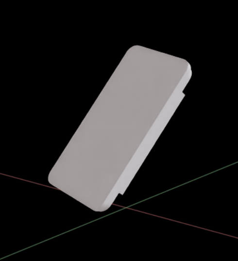

# Synaptics Tactile Newton

`synaptics-tactile-newton` is a Newton-native model of the **Synaptics Capacitive
Tactile Sensor (CTS)**. It turns per-contact forces computed by the
[Newton](https://github.com/newton-physics/newton) physics engine into a
per-taxel normal-force readout you can use directly as a robot-learning
observation — on GPU, with no CPU round-trip.



There are two parts to this repo:

- **The Isaac Sim extension** (`isaacsim_ext/synaptics.sensors.tactile`) — the
  sensor in the Isaac Sim GUI: a spawn menu, one-click demo scenes, and a live
  per-taxel heatmap. No code to write, so it is the fastest way to see the
  sensor work. Start at [Isaac Sim extension](#isaac-sim-extension).
- **The Python package** (`synaptics_tactile_newton`) — the same sensor model as
  a library, for standalone Newton simulations and robot-learning pipelines.
  See [The Python package](#the-python-package).

An **optional** Isaac Lab wrapper runs the sensor across many parallel
reinforcement-learning environments; it is never pulled in by the core install.

---

## What's in this repo

```
isaacsim_ext/                    # the Isaac Sim Kit extension
  synaptics.sensors.tactile/     #   spawn menu, live taxel panel, diagnostics
synaptics_tactile_newton/        # the Newton Package
  sensor.py                      #   CTSSensor — the sensor model
  output.py                      #   CTSOutput — the per-taxel force bundle
  display.py                     #   format_forces / print_forces helpers
  winkler.py                     #   WinklerReadout — optional readout correction
  kernels.py                     #   Warp signal-generation kernels
  isaaclab/                      #   OPTIONAL Isaac Lab wrapper (guarded import)
  assets/                        #   baked CTS USD geometry + taxel map
examples/                        # standalone Newton, Isaac Lab task
tests/                           # pytest suite
figures/                         # images used by this README
README.md                        # this document
CHANGELOG.md                     # release history
```

---

## Requirements

**Linux** (tested on Ubuntu 24.04), a CUDA GPU (Warp and Newton are GPU
engines), Python 3.12. macOS and Windows are not supported.

---

## Isaac Sim extension

`isaacsim_ext/synaptics.sensors.tactile` is a Kit extension that brings the CTS
sensor into the Isaac Sim GUI: a `Create → Sensors` spawn menu, a one-click demo
scene, and a live per-taxel heatmap. Every force value comes from `CTSSensor`
(see [The Python package](#the-python-package)), so the extension can never
drift from the model the tests cover.

Requires Isaac Sim **6.0.1** started on its **Newton** experience
(`./isaac-sim.newton.sh`); the default app disables the Newton backend and runs
PhysX.

Launch with the extension loaded straight from this repo — it finds the
`synaptics_tactile_newton` package sitting beside `isaacsim_ext/` on its own,
so nothing is copied or installed into Isaac Sim:

```bash
<isaac-sim>/isaac-sim.newton.sh \
    --ext-folder /path/to/synaptics-tactile-newton/isaacsim_ext \
    --enable synaptics.sensors.tactile
```

Or set it up once in the GUI: *Window → Extensions → ⚙ → extension search
paths*, add `/path/to/synaptics-tactile-newton/isaacsim_ext`, enable
**Synaptics Tactile Sensor (CTS)**, and toggle AUTOLOAD to have it on every
start.

Then `Window → Synaptics Tactile Sensor` → **Load Scenario** → **Play**.

(Only if you relocate the extension away from the repo does the package need
installing into Isaac Sim's python: `<isaac-sim>/python.sh -m pip install .`.
`PYTHONPATH` has **no effect** — Kit's embedded Python ignores it.)

Full documentation, including the diagnostics and the headless test harnesses,
is in
[`isaacsim_ext/synaptics.sensors.tactile/docs/README.md`](isaacsim_ext/synaptics.sensors.tactile/docs/README.md).

---

## The Python package

The sensor model as a library — what the extension above drives, and what
you import in a Newton simulation or a robot-learning pipeline.

Install from this repo — the package is not on PyPI yet:

```bash
./setup_newton.sh                  # .venv-newton with Newton, viewers, this package
source .venv-newton/bin/activate
```

(Into an environment you already manage: `pip install -e .[viewer,test]`.
Extras: `viewer` = Rerun web viewer, `test` = pytest, `isaaclab` = RL wrapper —
read [Optional: Isaac Lab integration](#optional-isaac-lab-integration) before
using that one.)

Then see the sensor work:

```bash
python examples/standalone_newton.py
```

This drops a known-mass cube onto the sensor and prints the per-taxel force
grid, with a Rerun web viewer on port 9090 (`--no-viewer` to disable; on a
remote host see [Examples](#examples) for port forwarding).

Top-level API:

```python
from synaptics_tactile_newton import CTSSensor, CTSOutput, print_forces, WinklerReadout
```

- **`CTSSensor`** — attaches to a Newton `Model`, matches the sensor's force-area
  shapes, and each step reduces the contacts on those shapes to a per-taxel
  normal force.
- **`CTSOutput`** — the result bundle (all GPU `wp.array`):
  - `force` — per-taxel normal force `[N]`, shape `(num_taxels,)`
  - `total_force` — net force vector `[N]` on the sensing surface, shape `(3,)`
- **`print_forces` / `format_forces`** — pretty-print the taxel grid to the
  terminal.
- **`WinklerReadout`** — host-side post-process that respreads the
  engine's per-taxel split as a Winkler foundation, preserving each pressing
  body's total. Read its
  [limitations](#limitations--known-issues) before using it.

The **baked CTS USD asset** and its **taxel map** (taxel names, centroids, press
axis) ship inside `synaptics_tactile_newton/assets/` and travel with the wheel.

### Minimal usage

```python
from synaptics_tactile_newton import CTSSensor, print_forces

sensor = CTSSensor(
    model,                                   # a finalized Newton Model
    sensing_shape_pattern="*/forceArea_*",   # which shapes are taxels
    taxel_map="path/to/cts0.0_taxel_map.json",
    force_max=10.0,                          # per-taxel saturation [N]
)

# inside the sim loop, after solver + contact update:
sensor.update(state, contacts)
print_forces(sensor.data)                    # per-taxel grid + total
forces = sensor.data.force.numpy()           # (num_taxels,) normal force [N]
```

---

## Optional: Isaac Lab integration

The `isaaclab_task.py` example and the `synaptics_tactile_newton.isaaclab`
wrapper run the sensor across many parallel environments on the Isaac Lab
**Newton backend**. The core package and the standalone example need none of
this.

You need a local checkout of **Isaac Lab 3.0+** (the first release with the
Newton backend; not on PyPI, which is also why this package's `[isaaclab]`
extra cannot resolve from an index) with its `_isaac_sim` symlink pointing at
a matching Isaac Sim. Then build the example environment the way the demo's
`--help` describes — one `.venv-newton` holding this package and Isaac Lab's
core extensions:

```bash
./setup_newton.sh --with-isaaclab /path/to/IsaacLab
```

Already maintain an Isaac Lab environment of your own (`./isaaclab.sh -i`)?
Installing this package into it works too — the sensor itself needs only
`warp-lang` and `numpy`, which any Isaac Lab install already has. The example
still runs from this repo checkout either way (it reads the sensor assets
relative to its own location):

```bash
pip install -e "/path/to/synaptics-tactile-newton[viewer]"
```

> Isaac Lab pulls a large dependency tree (PyTorch + CUDA) and may downgrade
> `warp-lang` / `usd-core` to the versions it pins.

---

## Examples

All of these live in `examples/`.

| Example | What it does |
|---|---|
| `standalone_newton.py` | Newton-only drop test. Loads the CTS sensor, drops a known-mass cube, and prints per-taxel / total forces. Rerun web viewer on by default (`--no-viewer` to disable). The fastest way to see the sensor work. |
| `isaaclab_task.py` | Multi-environment Isaac Lab demo on the Newton backend. Clones the box-built sensor across environments and reads each environment's taxel forces independently — the RL-ready path. Drops a selectable object (`--object cube/sphere/cylinder`, optionally off-center via `--offset_x/--offset_y`) onto the pads, prints a per-environment force summary, and optionally saves per-step artifacts (`force.npy`, `total_force.npy`, `positions_w.npy`, `readout.csv`) plus a force-field heatmap PNG (`--save_dir`, `--heatmap`). Requires Isaac Lab. |

Run the standalone example — three alternatives, the same three its `--help`
lists:

```bash
# default: Rerun web viewer, cube drop, prints per-taxel + total force
python examples/standalone_newton.py

# headless: no viewer, run 400 steps
python examples/standalone_newton.py --steps 400 --no-viewer

# native OpenGL viewer window: interactive camera, pause/step (needs a display)
python examples/standalone_newton.py --gui
```

The Rerun web viewer serves its page on port **9090** but streams the actual
scene data over gRPC on port **9876**. When running on a remote/headless host
(SSH, VS Code Remote, a container), forward **both** ports to your local
machine or the viewer will load an empty page:

```bash
ssh -L 9090:localhost:9090 -L 9876:localhost:9876 user@host
```

(VS Code Remote usually auto-forwards 9090; add 9876 manually in the Ports
panel if the viewer stays blank.) Prefer no live viewer at all? Record to a file
with `--rrd out.rrd` and open it in the native Rerun desktop app.

Run the Isaac Lab example through the bundled launcher — it activates
`.venv-newton`, sets up the Isaac Sim environment, and starts the demo via
`isaaclab.sh` (see
[Optional: Isaac Lab integration](#optional-isaac-lab-integration) for the
environment):

```bash
# live view: watch a sphere press off-center into the pads
./run_isaaclab_demo.sh /path/to/IsaacLab \
    --num_envs 4 --object sphere --offset_x 0.004 \
    --steps 600 --viz newton

# artifacts: no viewer, dump per-step force/positions/CSV + a heatmap PNG
./run_isaaclab_demo.sh /path/to/IsaacLab \
    --num_envs 4 --object sphere --offset_x 0.004 \
    --steps 600 --save_dir ./cts_demo_artifacts --heatmap --viz none
```

`--object cube/sphere/cylinder` picks the indenter and `--offset_x/--offset_y`
press it off-center; `--steps` stops after a fixed run instead of running until
the window closes. `--viz` selects the viewer: `newton` for the native OpenGL
window (needs a display), `rerun` for the web viewer — the same one as the
standalone example, on the same two ports 9090 + 9876 — or `none` for headless.

---

## Testing

```bash
pip install -e .[test]
pytest
```

The suite covers dead-weight totals, per-taxel indentation and spatial response,
force-area coverage, and saturation. Tests marked `sim` run a real Newton
simulation and need the bundled CTS USD.

The Isaac Sim extension has its own harnesses, which run **inside Kit** because
a bare `python.sh` cannot import `pxr`, `warp`, `newton` or the Newton backend.
Each exits non-zero on failure, so they double as CI gates — see
[the extension's README](isaacsim_ext/synaptics.sensors.tactile/docs/README.md):

| Harness | Checks |
|---|---|
| `kit_diagnostics.py` | environment preflight: versions, backend, solver, assets |
| `kit_smoke.py` | spawn a sensor, build the panel |
| `kit_scenario_test.py` | the demo scene reaches a state the sensor can bind to |
| `kit_dead_weight.py` | drop a known mass, Σ taxel force ≈ *m·g* |
| `kit_robustness.py` | full-array press; two sensors on one stage |

---

## Limitations & known issues

- **GPU required.** Warp and Newton execute on CUDA; there is no CPU fallback for
  the sensor.

- **The Isaac Lab example builds the sensor from primitive boxes, not from a
  USD-referenced dynamic rigid body.** OpenUSD's parallel physics parse
  (`UsdPhysics.LoadUsdPhysicsFromRange`) has a thread-safety race that corrupts
  the heap when a single rigid body owns many (~30+) colliders — which the CTS
  sensor does (one body, ~50 force areas). Isaac Lab's per-environment cloner
  re-parses that body and reliably hits the race. The documented single-thread
  workaround (`PXR_WORK_THREAD_LIMIT=1`) **cannot be applied inside Isaac Sim/Kit**
  because a core Kit extension forces `PXR_WORK_THREAD_LIMIT=16` before USD
  initializes — see
  [isaac-sim/IsaacSim#692](https://github.com/isaac-sim/IsaacSim/issues/692). The
  example therefore reads the force-area geometry with `UsdGeom` bounds only and
  replays it as boxes on a Newton body, so no sensor physics schema is ever
  parsed. This is a solid, portable path; referencing the multi-collider sensor
  as a dynamic USD rigid body is not supported on the current stack.

- **In the Isaac Sim extension the sensor is statically mounted**, for the same
  OpenUSD reason as above: static colliders are unaffected by that race at any
  count, so a bench-mounted sensor pressed by a moving indenter works today
  while a robot-link-mounted one does not. That needs OpenUSD ≥ 26.5, which
  arrives with Newton 1.5.0.

- **Presses wider than the taxel array under-read.** In the shipped asset the
  module base is coplanar with the force areas and extends further out, so a
  flat indenter overhanging the array rests on the base and the taxels barely
  register. Keep contact inside the array (x ±14.75 mm, y ±6.45 mm on CTS0.0).
  Real hardware has a rubber pad proud of the base, so this is an asset-fidelity
  gap rather than a physical one.

- **`WinklerReadout` sees pressing objects only through box, sphere, capsule and
  cylinder collision shapes.** It derives each taxel's indentation from the
  presser's surface, so a body carrying none of those (a mesh, a convex hull) is
  invisible to the correction and its taxels keep the raw engine forces. Four
  further constraints on the correction:

  - **Single-world models only — the batched Isaac Lab wrapper is not handled.**
    `WinklerReadout` reads one `Model`/`State` pair and one flat taxel array, so
    the multi-environment path in `synaptics_tactile_newton.isaaclab` reports the
    engine's raw split.
  - **The default cell aperture assumes the sensor does not rotate mid-run.** The
    in-plane sample offsets are resolved once, at the first update, from the
    sensor's press axis. A sensor that reorients while running needs point
    sampling (`aperture=None`).
  - **`delta0` sets the apparent contact-patch size under a curved presser**
    (`a ≈ sqrt(2·R·delta0)` for a sphere of radius R), standing in for the pad's
    physical compliance. The 0.3 mm default is fine for flat faces, where it is
    pure numerical conditioning and any value well above the geometric noise
    gives the same profile; calibrate it if patch width matters to you.
  - **It is a host-side post-process.** It runs in NumPy after `sensor.update`
    and copies forces, taxel positions and body poses off the GPU each time it is
    called, so it breaks the core sensor's GPU-only data path. Call it at your
    readout rate rather than every solver step.

- **The box-built sensor body is kinematic (perfectly rigid).** For stable
  contact the solver step must stay below roughly `sqrt(m / contact_ke)`; a body
  gets a per-world shape index (so forces report in every environment), but with
  a coarse step a light object will bounce instead of settling. Use a fine step,
  e.g. `SimulationCfg(dt=1/480)` with `NewtonCfg(num_substeps=4)`, and give the
  MuJoCo-Warp solver enough buffer headroom (`MJWarpSolverCfg(njmax=512,
  nconmax=256)`) when scaling up environments.

---

## Tested against

This release was validated on the following stack:

| Component | Version |
|---|---|
| Python | 3.12 |
| OS | Ubuntu 24.04 |
| Newton | 1.2.0 |
| Warp (`warp-lang`) | 1.13.0 |
| `usd-core` | 25.11 |
| Isaac Sim (Isaac Lab example) | 6.0.1 |
| Isaac Sim (Kit extension) | **6.0.1**, Newton experience |
| `isaacsim.physics.newton` (Kit extension) | 0.8.x |
| Isaac Lab (for the Isaac Lab example) | 3.0.0-beta2 |
| GPU | NVIDIA RTX (CUDA) |

Other versions may work but are untested. The Isaac Sim / Isaac Lab versions
apply only to the extension and the Isaac Lab wrapper; the core Newton package
and the standalone example do not need them.

The Kit extension needs Isaac Sim **6.0** or newer, because the Newton backend
(`isaacsim.physics.newton`) does not exist before it — 5.x is PhysX-only.
